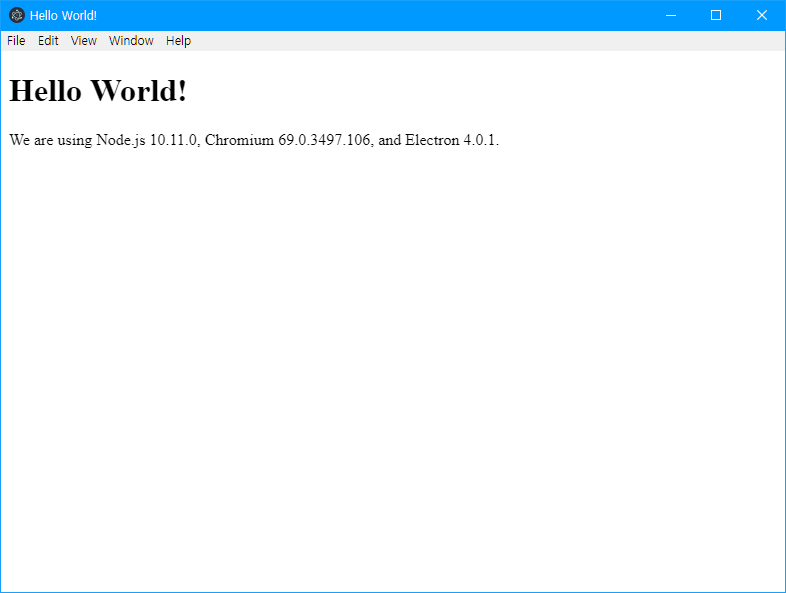
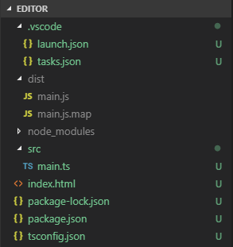
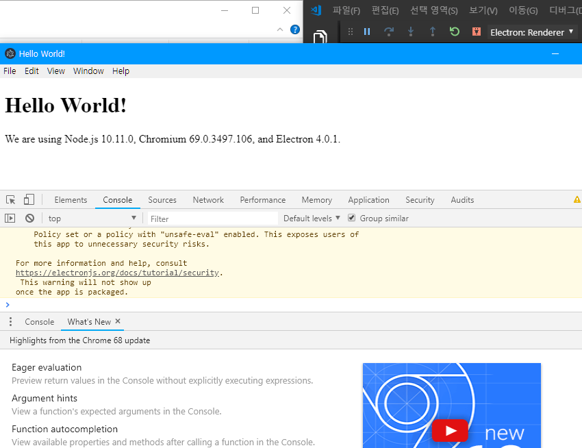
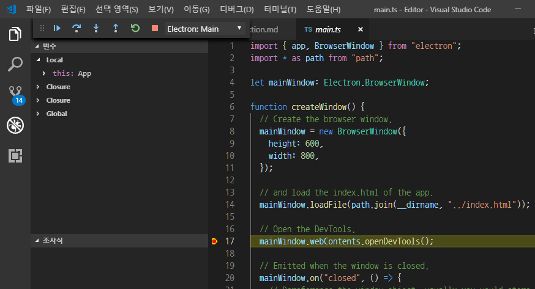

# Electron TypeScript

## 개발환경 준비

### 1. Node.js 설치하기

Electron 프로젝트를 만들기 위해서는 Node.js와 Node Package Manager (npm)이 필요합니다.  
https://nodejs.org/ 로 가서 Node.js를 설치할 수 있습니다.

이미 설치되어 있다면 이 과정을 건너뛰세요.

### 2. Visual Studio code 설치하기

디버깅하기 최적화 된 환경을 이용하기 위해 vscode를 사용합니다.  
https://code.visualstudio.com/ 에서 설치할 수 있습니다.

이미 설치되어 있다면 이 과정을 건너뛰세요.

### 3. npm을 통해 TypeScript 컴파일러 설치

터미널에 다음 명령어를 실행하세요. 컴파일러를 이미 설치했다면 이 과정을 건너뛰세요.

```shell
npm install -g typescript
```

## 프로젝트 준비

프로젝트를 만들고 싶은 곳에 프로젝트 폴더를 만들고, vscode로 폴더를 열어줍니다.  
그런 다음, <kbd>Ctrl</kbd> + <kbd>`</kbd>를 눌러 현재 폴더에 위치한 터미널을 실행할 수 있습니다.

### 1. 프로젝트 폴더에 npm `package.json` 정보 추가하기

하단의 터미널에 다음 명령어를 실행하세요.

```shell
npm init
```

그런 다음, 터미널에서 안내하는 대로 프로젝트 정보를 작성합니다.

`package name`   : 프로젝트 이름 (영어 소문자, - . 만 사용 가능)  
`version`        : 프로젝트 버전 (1.0.0인 기본값을 사용하려면 아무것도 쓰지 않고 넘깁니다.)  
`description`    : 프로젝트의 한줄 요약 정보를 기재합니다.  
`entry point`    : 프로젝트의 npm 어플리케이션 주 진입점입니다. `dist/main.js`를 써주세요.  
`test command`   : npm으로 실행할 시, 순서대로 셸에서 실행할 코드를 기입하는 곳입니다. (`npm test`로 실행 가능)  
`git repository` : 프로젝트의 git 저장소 주소 정보입니다.  
`keywords`       : 프로젝트가 가진 특징 단어를 기입할 수 있습니다.  
`author`         : 프로젝트를 소유한 사람의 이름을 기입할 수 있습니다.  
`license`        : 프로젝트의 라이센스를 기입할 수 있습니다. (이름만)

이 과정을 거치면, 터미널에 package.json에 들어갈 정보를 정리해서 보여주고, 이 정보가 맞는 지 확인합니다.  
<kbd>Enter</kbd> (yes)를 눌러서 작업을 마칩니다.

### 2. npm을 통해 프로젝트 폴더에 기본 Electron 앱 준비

하단의 터미널에 다음 명령어를 실행하세요. 이 과정은 조금 오래 걸릴 수 있습니다.

```shell
npm i -D electron@latest
```

### 3. 상태 확인

프로젝트 폴더에 설치된 기본 Electron앱의 상태를 확인해봅시다.  

vscode의 좌측 탐색기에 마우스를 올리면, 프로젝트 폴더 이름 옆에 4개의 아이콘이 나타납니다.

두번째 아이콘인 폴더 생성으로 `dist`라는 이름의 폴더를 만든 후, 첫번째 아이콘인 새 파일 만들기를 통해 파일의 이름을 `main.js`로 `dist`폴더 안에 만들어줍니다.

`main.js` 스크립트 안에는 아래의 주소에 있는 코드를 모두 복사해줍시다.  
https://github.com/electron/electron-quick-start/blob/master/main.js

마지막으로, 가장 상위 폴더에 `index.html`파일을 만들고, 아래의 주소에 있는 코드를 모두 복사해줍니다.  
https://github.com/electron/electron-quick-start/blob/master/index.html

그런 다음, `index.html` 16번째 줄에 있는 텍스트를 주석으로 만들어줍니다.
```html
...
    <script>
      // You can also require other files to run in this process
 ->   // require('./renderer.js')
    </script>
...
```

이 과정을 모두 끝냈다면, 아래의 터미널에서 이 명령을 실행해보세요.
```
.\node_modules\.bin\electron.cmd .
```

  
작동하는 것을 확인할 수 있습니다.

## vscode와 TypeScript 빌드 환경 준비

이제 타입스크립트를 사용할 수 있어야 합니다.  
우선 타입스크립트 코드를 추가해봅시다.

### 1. TypeScript 컴파일 환경 준비

`dist`폴더를 만들었던 것 처럼, `src`폴더를 만들어줍니다.  
그리고 그 안에는 `main.ts`파일을 만든 후, 코드 안의 내용을 아래의 주소에서 모두 복사하세요.  
https://github.com/electron/electron-quick-start-typescript/blob/master/src/main.ts

그런 다음, 프로젝트 폴더에 `tsconfig.json`파일을 만든 후, 아래의 코드를 복사합니다.
```json
{
    "include":[
        "src/**/*"
    ],
    "exclude":[
        "node_modules"
    ],
    "compilerOptions":{
        "target":"ES5",
        "module":"commonjs",

        "locale":"ko",
        "pretty":true,

        "rootDir":"src",
        "outDir":"dist",

        "charset": "utf8",
        "emitBOM": false,
        "removeComments": true,

        "sourceMap": true
    }
}
```

저장한 후, 아래의 터미널에 `tsc`를 입력한 후, 기다립니다.  
`dist`폴더 안에 `main.js.map`파일이 생성됐다면 TypeScript 컴파일 환경이 준비됐다는 뜻입니다.

### 2. vscode 디버깅 환경 준비

프로젝트 폴더에 `.vscode`폴더를 만듭니다.  
우선 TypeScript를 컴파일 해야 하기 때문에, 이 폴더 안에 `tasks.json`파일을 만들어줍니다.

`tasks.json`는 아래의 코드를 사용합니다.

```json
{
    "version": "2.0.0",
    "tasks": [
        {
            "label": "TypeScript compile",
            "type": "typescript",
            "tsconfig": "tsconfig.json",
            "problemMatcher": [
                "$tsc"
            ],
            "group": {
                "kind": "build",
                "isDefault": true
            }
        }
    ]
}
```

그리고 vscode에서 F5를 눌러 디버그를 실행하기 위해 `launch.json`파일을 만듭니다.  
이것도 똑같이 아래의 코드를 사용합니다.
```json
{
    "version": "2.0.0",
    "compounds": [
        {
            "name": "Electron: All",
            "configurations": [
                "Electron: Main",
                "Electron: Renderer"
            ]
        }
    ],
    "configurations": [
        {
            "name": "Electron: Main",
            "type": "node",
            "request": "launch",
            "program": "${workspaceRoot}/src/main.ts",
            "stopOnEntry": false,
            "args": [],
            "cwd": "${workspaceRoot}",
            "runtimeExecutable": "${workspaceRoot}/node_modules/.bin/electron.cmd",
            "runtimeArgs": [
                "--remote-debugging-port=9223",
                "--enable-logging"
            ],
            "env": {},
            "sourceMaps": true,
            "outFiles": [
                "${workspaceRoot}/dist/**/*.js"
            ],
            "internalConsoleOptions": "openOnSessionStart",
            "console": "integratedTerminal",
            "preLaunchTask": "TypeScript compile"
        },
        {
            "name": "Electron: Renderer",
            "type": "chrome",
            "request": "attach",
            "port": 9223,
            "webRoot": "${workspaceFolder}",
            "timeout": 30000
        }
    ]
}
```

이제 저장을 하고 나면, 프로젝트 폴더 구조는 아래와 같은 모습이 됩니다.  


### 3. 디버그 실행하기

이제 vscode의 좌측에 있는 아이콘 중, 네번째에 있는 곤충 아이콘(디버그 메뉴)를 클릭합니다.  
그러면 맨 위에 디버그 버튼을 볼 수 있는데, 그 옆에 `Electron: Main`을 클릭해서 `Electron: All`로 바꿔줍니다.  
그런 다음, 초록색 버튼을 클릭합니다.

그러면, vscode가 디버그 모드로(하단이 주황색으로 바뀜) 바뀌고, 일렉트론 앱이 실행되면서 개발자 콘솔이 열리게 됩니다.  


### 4. 마지막으로 디버그 패널이 잘 동작하는 지 확인하기

실행됐던 일렉트론 앱을 종료하면 vscode가 디버그 모드를 종료합니다.  
(또는 디버그 버튼에서 종료)

이제 다시 `main.ts`로 돌아가 17번 줄에 브레이크 포인트를 추가해봅시다.  
브레이크 포인트는 왼쪽 줄 번호의 빈 공간을 클릭하면 됩니다.

브레이크 포인트를 추가하면 빨간 동그라미가 생기게 됩니다.  
이제 F5를 눌러 디버그를 실행해봅시다.

그러면 사진과 같이 브레이크 포인트에서 동작을 일시중지 하는 모습을 볼 수 있습니다.  


vscode의 파란색 재생 버튼을 클릭해 코드를 계속 실행해 잘 동작하는 지 확인하면, vscode로 타입스크립트와 일렉트론 앱을 개발하는 환경이 준비됐습니다!  
웹 프로그램을 만들어보세요!